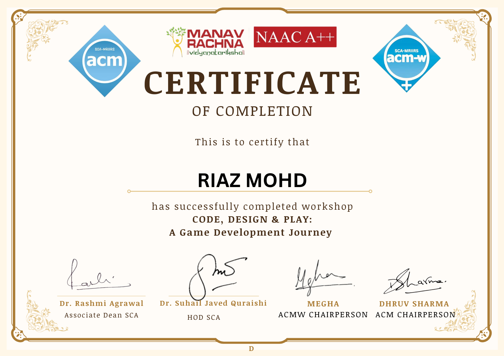
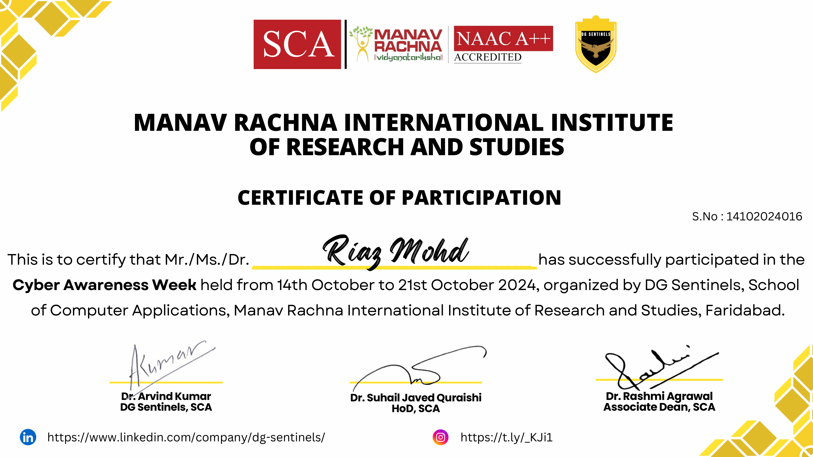

# Riaz Mohd. - Portfolio

Welcome to my personal portfolio! I'm Riaz Mohd., a college student pursuing BCA with a focus on AI & ML. This portfolio showcases my skills, projects, certifications, and accomplishments. Feel free to explore and get to know more about me and the work I've done.

## 👨‍💻 About Me

I am a Frontend Developer with hands-on experience in HTML, CSS, JavaScript, React.js, and Java. I am passionate about coding, building interactive web applications, and diving into Artificial Intelligence and Machine Learning. I aim to blend creativity with technology to create efficient solutions.

---

## 🌟 Projects

Here are some of the key projects I’ve worked on:

1. **Portfolio Website**: A personal portfolio website built with HTML, CSS, and JavaScript to showcase my work.
2. **Vehicle Management App**: A Java-based application to manage vehicle data.
3. **Quiz Game**: A fun interactive quiz game built using JavaScript.

You can view all these projects and more in my repository.

---

## 🔧 Skills

- **Frontend Development**: HTML5, CSS3, JavaScript (ES6+), React.js
- **Backend**: Java, Node.js (learning)
- **Version Control**: Git & GitHub
- **Other**: Responsive Design, C Programming, Video Editing

---

## 🎓 Certifications

Here are some of the certifications I’ve earned:

- **Certification 1** (e.g., "Frontend Development Basics")
- **Certification 2** (e.g., "React.js Mastery")
- **Certification 3** (e.g., "Java Programming")

(You can click the images below to see them more clearly.)

  
  


---

## 🚀 How to Access My Portfolio

You can visit my live portfolio by clicking the link below:

[**Riaz Mohd. Portfolio**]([[[https://github.com/your-username/portfolio](http://127.0.0.1:5500/riazmohd.html](https://github.com/Riaz1909/Portfolio)](https://github.com/Riaz1909/Portfolio))

---

## 📂 Repository Structure

├── index.html # Main HTML page for the portfolio
├── assets/ # Folder containing images and other media
│ ├── cert1.png # Certification image 1
│ └── cert2.png # Certification image 2
├── css/ # Styles for the portfolio
│ └── style.css # Main CSS file
├── js/ # JavaScript for interactive elements
│ └── script.js # Main JavaScript file
├── README.md # This file
└── other-files/ # Additional project files

---

## 📍 How to Run Locally

To run the portfolio locally:

1. Clone the repository:
   ```bash
   git clone https://github.com/your-username/portfolio.git
2.Navigate into the project directory:

bash
cd portfolio

3. Open index.html in your browser to view your portfolio.

💬 Contact Me
You can reach me at:

Email: riazmohd98769@gmail.com
LinkedIn: [Your LinkedIn Profile](https://www.linkedin.com/in/riaz-mohd-71844b355/)

GitHub: 


Feel free to connect with me, ask questions, or collaborate on projects!
